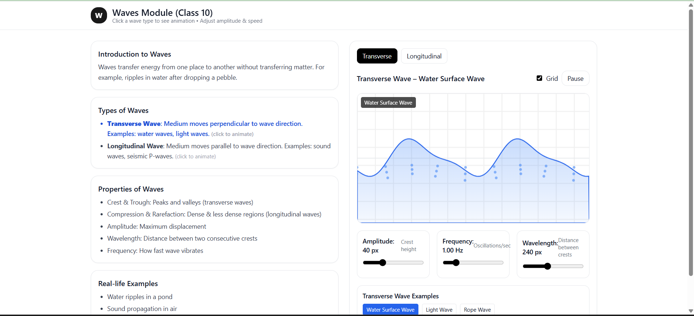

Waves Module - Class 10 Interactive Educational Module
Overview

This project is an interactive educational module built in React for Class 10 students to learn about waves.
It includes simulations, animations, and interactive controls to help students understand transverse and longitudinal waves through real-life examples such as water waves, light waves, sound waves, and rope pulses.

Features

Transverse & Longitudinal Waves

Visualize how the medium moves (perpendicular or parallel to wave propagation)

Selectable Wave Examples

Water surface waves, light waves, rope pulses, sound waves, seismic P-waves, slinky compression

Interactive Sliders

Adjust Amplitude, Frequency, and Wavelength in real-time

Play/Pause & Grid Overlay

Dynamic Canvas Animation

Smooth wave motion using HTML5 Canvas and requestAnimationFrame

Responsive Design

Works on different screen sizes with a 16:9 aspect ratio canvas

Screenshots / GIFs

Tech Stack

React.js

Framer Motion (animations)

Tailwind CSS (styling)

HTML5 Canvas API (wave simulations)

How to Run Locally

Clone the repository:

git clone https://github.com/your-username/animation-module.git

Navigate into the project directory:

cd animation-module

Install dependencies:

npm install

Start the development server:

npm start

Open http://localhost:3000
 in your browser.

Usage

Select Wave Type: Click "Transverse" or "Longitudinal"

Choose Example: Click any example below the canvas to see its animation

Adjust Sliders: Modify Amplitude, Frequency, and Wavelength

Pause/Play: Click the Pause/Play button to control animation

Toggle Grid: Check or uncheck the "Grid" box

Educational Value

Demonstrates wave propagation in different media

Shows real-life examples of waves

Helps students visualize complex physics concepts interactively

Deployment

This module is hosted and can be accessed at:
https://animation-module-yrkw.vercel.app/